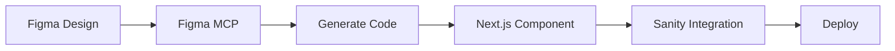

# Getting Started: Mamma Maria Website

**Быстрый старт** для команды по переходу на современный стек (Next.js + Tailwind + Sanity).

## 🎯 Цель проекта

Этот проект служит **пилотом** для перехода команды с WordPress на:
- **Next.js 15** - Modern React framework
- **Tailwind CSS 4** - Utility-first styling
- **Sanity CMS** - Headless content management
- **Figma MCP** - Автоматическая генерация кода

## 📚 Документация

### Обязательно к прочтению:

1. **[README.md](./README.md)** - Overview проекта, стек, структура
2. **[Figma → Code Workflow](./docs/workflow/figma-to-code.md)** - Как переносить дизайн pixel-perfect
3. **[Sanity Setup](./docs/workflow/sanity-setup.md)** - Настройка CMS и content management

### Дополнительно:

- [Tailwind Guidelines](./docs/workflow/tailwind-guidelines.md) - Best practices
- [Components Guide](./docs/workflow/components.md) - Структура компонентов
- [Content Management](./docs/content-management/) - Гайды для менеджеров

## 🚀 Quick Start (5 минут)

### 1. Prerequisites

Установить необходимые инструменты:

```bash
# Node.js >= 18
node --version

# pnpm (рекомендуется)
npm install -g pnpm

# Figma Desktop app
# https://www.figma.com/downloads/
```

### 2. Clone проекта

```bash
git clone <repo-url>
cd mamma-maria-website
```

### 3. Установка зависимостей

```bash
# Next.js app
cd website
pnpm install

# Sanity Studio
cd ../sanity
pnpm install
```

### 4. Environment Variables

Создать `.env.local` файлы:

**website/.env.local:**
```env
NEXT_PUBLIC_SANITY_PROJECT_ID=your_project_id
NEXT_PUBLIC_SANITY_DATASET=production
SANITY_API_TOKEN=your_api_token
NEXT_PUBLIC_SITE_URL=http://localhost:3000
```

**sanity/.env.local:**
```env
SANITY_STUDIO_PROJECT_ID=your_project_id
SANITY_STUDIO_DATASET=production
```

### 5. Запуск Development

```bash
# Terminal 1: Next.js
cd website
pnpm dev
# → http://localhost:3000

# Terminal 2: Sanity Studio
cd sanity
pnpm dev
# → http://localhost:3333
```

---

## 📖 Процесс разработки (Overview)

### Workflow: Design → Code → Content



### Step-by-Step:

#### 1. Анализ дизайна из Figma
```markdown
- Открыть Figma Desktop
- Найти секцию (например, Hero)
- Изучить структуру, spacing, colors
```

#### 2. Генерация кода через Figma MCP
```markdown
- Выбрать секцию в Figma Desktop (кликнуть)
- Скопировать ссылку (Cmd/Ctrl + L)
- В Craft Agent: "Сгенерируй React компонент..."
```

#### 3. Review и адаптация
```markdown
- Проверить соответствие дизайну (pixel-perfect)
- Адаптировать для Tailwind 4
- Добавить responsive breakpoints
- Оптимизировать для Next.js (Image, Font)
```

#### 4. Интеграция с Sanity
```markdown
- Определить динамические части (текст, изображения)
- Создать Sanity schema
- Обновить компонент для fetch данных
- Наполнить контентом через Sanity Studio
```

#### 5. Test & Deploy
```markdown
- Visual regression check
- Performance (Lighthouse)
- Accessibility
- Git commit + Deploy
```

**Детали:** См. [docs/workflow/figma-to-code.md](./docs/workflow/figma-to-code.md)

---

## 🎨 Design System

### Принципы:

- **Single Source of Truth:** Figma дизайн = 100% точность
- **Component-based:** Каждая секция = переиспользуемый компонент
- **Design Tokens:** Цвета, шрифты, spacing из Figma
- **Responsive-first:** Mobile → Tablet → Desktop

### Breakpoints:

```typescript
// Tailwind breakpoints
mobile:   < 768px  (default)
md:       >= 768px (tablet)
lg:       >= 1024px (desktop)
xl:       >= 1280px (wide)
```

### Typography:

```typescript
// Из Figma:
Heading 1: 84px / 126px (Playfair Display)
Heading 2: 67px / 100px
Body:      24px / 36px (Inter)
Small:     18px / 27px
```

---

## 📦 Project Structure

```
mamma-maria-website/
├── docs/                    # 📚 Документация
│   ├── workflow/
│   │   ├── figma-to-code.md
│   │   ├── sanity-setup.md
│   │   └── components.md
│   └── content-management/
│       └── sanity-guide.md
│
├── website/                 # Next.js App
│   ├── app/
│   │   ├── layout.tsx
│   │   ├── page.tsx         # Home page
│   │   └── (sections)/      # Section routes
│   ├── components/
│   │   ├── sections/        # Page sections
│   │   │   ├── HeroSection.tsx
│   │   │   ├── AboutSection.tsx
│   │   │   └── index.ts
│   │   └── ui/              # UI components (Button, Card, etc.)
│   ├── lib/
│   │   └── sanity/
│   │       ├── client.ts
│   │       └── queries.ts
│   └── public/
│       └── images/
│
├── sanity/                  # Sanity Studio
│   ├── schemas/
│   │   ├── heroSection.ts
│   │   ├── menuItem.ts
│   │   ├── testimonial.ts
│   │   ├── faqItem.ts
│   │   └── index.ts
│   └── sanity.config.ts
│
└── figma-exports/           # Экспорты из Figma
    └── sections/
```

---

## 🛠️ Tools & Scripts

### Development:
```bash
pnpm dev              # Start Next.js
pnpm dev:sanity       # Start Sanity Studio
pnpm lint             # Run ESLint
pnpm format           # Run Prettier
pnpm type-check       # TypeScript check
```

### Build:
```bash
pnpm build            # Build Next.js
pnpm build:sanity     # Build Sanity
```

### Deployment:
```bash
pnpm deploy           # Deploy to Vercel
pnpm deploy:sanity    # Deploy Sanity Studio
```

---

## ✅ Checklist: First Component

Для первого компонента (например, Hero Section):

### Design Phase:
- [ ] Открыт Figma Desktop app
- [ ] MCP server активирован (Shift+D → Enable MCP)
- [ ] Секция выбрана и ссылка скопирована

### Code Generation:
- [ ] Код сгенерирован через Figma MCP
- [ ] Проверено соответствие дизайну (pixel-perfect)
- [ ] Адаптирован для Tailwind 4
- [ ] Добавлены responsive breakpoints
- [ ] Next.js оптимизации применены (Image, Font)

### Sanity Integration:
- [ ] Sanity проект создан
- [ ] Schema определен для секции
- [ ] Компонент обновлен для fetch данных
- [ ] Initial content добавлен в Sanity Studio

### Quality Check:
- [ ] Visual regression OK (Figma vs Live)
- [ ] Responsive работает (mobile/tablet/desktop)
- [ ] Performance: Lighthouse score > 90
- [ ] Accessibility: ARIA labels, semantic HTML
- [ ] TypeScript: no errors
- [ ] ESLint: no warnings

### Deployment:
- [ ] Git commit с descriptive message
- [ ] Documentation updated
- [ ] Deployed to Vercel
- [ ] QA testing passed

---

## 🚨 Common Issues

### Figma MCP: "Nothing is selected"

**Problem:** Секция не выбрана в Figma Desktop

**Solution:**
1. Открыть Figma Desktop
2. **Кликнуть** на нужную секцию
3. Повторить генерацию

### Sanity: Connection failed

**Problem:** API token не настроен или истек

**Solution:**
1. Получить новый token из Sanity Manage
2. Добавить в `.env.local`
3. Перезапустить dev server

### Next.js: Image optimization error

**Problem:** External images не настроены

**Solution:**
```typescript
// next.config.js
images: {
  remotePatterns: [
    {
      protocol: 'https',
      hostname: 'cdn.sanity.io'
    }
  ]
}
```

---

## 📚 Learning Resources

### Для команды:

#### Next.js:
- [Next.js 15 Docs](https://nextjs.org/docs)
- [App Router Guide](https://nextjs.org/docs/app)
- [Image Optimization](https://nextjs.org/docs/app/building-your-application/optimizing/images)

#### Tailwind CSS 4:
- [Tailwind Docs](https://tailwindcss.com/docs)
- [Tailwind 4 Changes](https://tailwindcss.com/docs/upgrade-guide)
- [Utility-First](https://tailwindcss.com/docs/utility-first)

#### Sanity:
- [Sanity Documentation](https://www.sanity.io/docs)
- [Content Modeling](https://www.sanity.io/docs/content-modelling)
- [GROQ Query Language](https://www.sanity.io/docs/groq)

#### Figma MCP:
- [Figma MCP Guide](https://developers.figma.com/docs/figma-mcp-server/)
- [Tools & Prompts](https://developers.figma.com/docs/figma-mcp-server/tools-and-prompts/)

---

## 🎓 Training Plan

### Week 1: Setup & First Component
- [ ] Setup development environment
- [ ] Read Figma → Code workflow
- [ ] Generate first component (Hero)
- [ ] Basic Sanity integration

### Week 2: Full Landing Page
- [ ] Generate all sections from Figma
- [ ] Complete Sanity schemas
- [ ] Responsive design for all breakpoints
- [ ] Performance optimization

### Week 3: Polish & Deploy
- [ ] Visual regression testing
- [ ] Accessibility improvements
- [ ] SEO optimization
- [ ] Production deployment

### Week 4: Team Knowledge Transfer
- [ ] Content management training
- [ ] Workflow documentation review
- [ ] Q&A session
- [ ] Next project planning

---

## 🤝 Team Collaboration

### Roles:

**Developer:**
- Генерация кода из Figma
- Компонентная разработка
- Sanity integration
- Deployment

**Content Manager:**
- Sanity Studio management
- Content entry & editing
- Image uploads
- Quality assurance

**Designer:**
- Figma design maintenance
- Design system updates
- Component specifications
- Visual QA

---

## 📧 Support

Вопросы и проблемы:
- **Tech Lead:** [email]
- **Design:** [email]
- **Project:** info@mamma-maria.de

---

## 🎉 Success Criteria

Проект считается успешным когда:

- ✅ Все секции реализованы pixel-perfect
- ✅ Sanity CMS полностью интегрирован
- ✅ Lighthouse score > 90 на всех страницах
- ✅ Команда может самостоятельно создавать компоненты из Figma
- ✅ Content managers comfortable с Sanity Studio
- ✅ Deployed в production
- ✅ Client approval

**Target:** 3-4 недели от старта до production

---

**Created:** February 2026
**Last Updated:** 2026-02-08
**Version:** 1.0
**Team:** 2Penguins Digital

🚀 **Let's build something amazing!**
